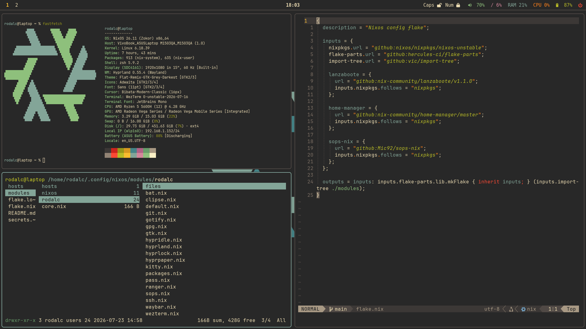

# NixOS configuration

A modular NixOS configuration based on [@vimjoyer](https://github.com/vimjoyer) configuration and videos.

It uses Home Manager module and a dendritic pattern.
The most significant aspects are [full disk encryption](https://wiki.nixos.org/wiki/Full_Disk_Encryption#), [secure boot](https://nix-community.github.io/lanzaboote/getting-started/prepare-your-system.html), and [sops-nix](https://github.com/Mic92/sops-nix) for secure secrets management.

The following table summarizes the primary components and applications used in this configuration:

| Feature            | Program                           |
| ------------------ | --------------------------------- |
| Wayland compositor | Hyprland                          |
| Display Manager    | None (full disk encryption)       |
| Lock screen        | Hyprlock                          |
| Bar                | Waybar                            |
| Launcher           | Wofi                              |
| Terminal emulator  | Wezterm                           |
| Shell              | ZSH with grml-config and vim mode |
| Code editor        | Neovim                            |
| Password Manager   | Pass                              |
| Theme              | Gruvbox Dark                      |
